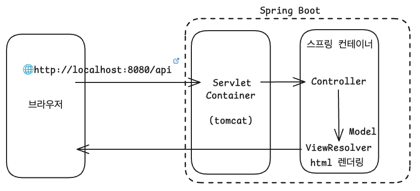

# Spring Boot의 동작 방식에 대해 설명하시오.

브라우저 요청부터 HTML 응답까지의 전체 흐름은 다음과 같다.

<small>Tomcat은 서블릿 컨테이너의 구현체 중 하나</small>

이미지에서 보이는 것처럼, 스프링 컨테이너 내부에서는 Controller, Model, ViewResolver가 서로 협력하여 하나의 요청을 처리한다. 이러한 구조를 흔히 MVC(Model-View-Controller) 모델이라고 부른다.

사용자의 요청은 Controller가 받아 처리하고, 필요한 데이터를 Model로부터 조회한 뒤, ViewResolver를 통해 적절한 View로 응답하게 되는 것이다.

여기서 말하는 스프링 컨테이너는 단일한 객체라기보다는 여러 역할을 담당하는 내부 컴포넌트들로 구성되어있다. 대표적으로 서블릿 컨테이너(tomcat), DispatcherServlet 등이 존재한다.

ViewResolver의 경우 뷰의 렌더링 역할을 담당하기 때문에 뷰 객체를 반환하고, REST 형식의 경우 뷰 리졸버를 호출하지 않고 MessageConverter를 거쳐 JSON 형식으로 변환하여 응답한다.

