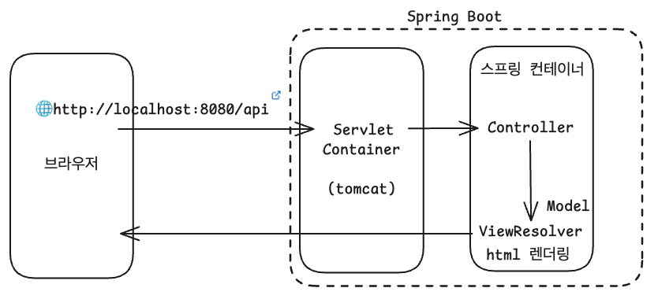
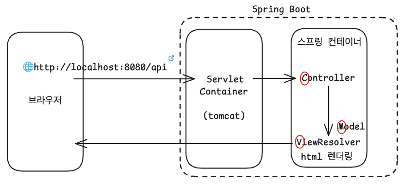
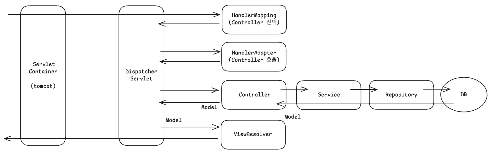
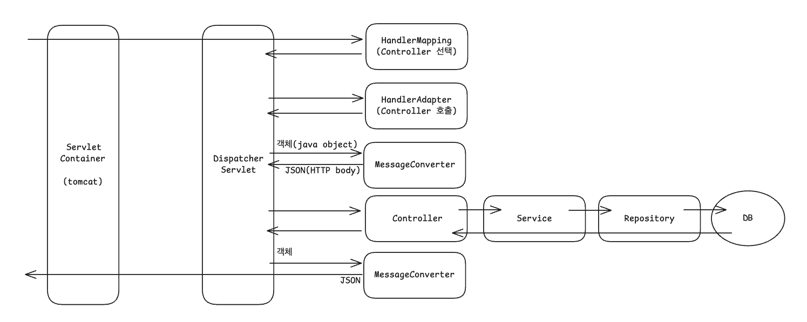
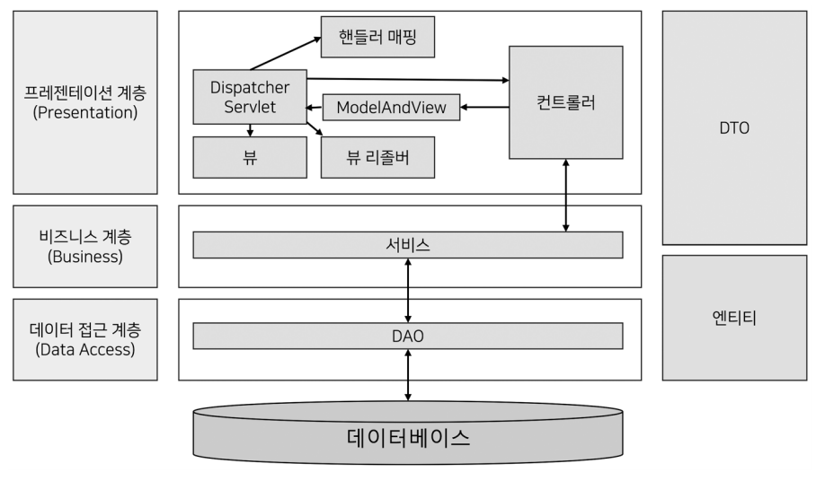

# Spring Boot의 동작 방식에 대해 설명하시오.

브라우저 요청부터 HTML 응답까지의 전체 흐름은 다음과 같다.

<small>Tomcat은 서블릿 컨테이너의 구현체 중 하나</small>

이미지에서 보이는 것처럼, 스프링 컨테이너 내부에서는 Controller, Model, ViewResolver가 서로 협력하여 하나의 요청을 처리한다. 이러한 구조를 흔히 MVC(Model-View-Controller) 모델이라고 부른다.

사용자의 요청은 Controller가 받아 처리하고, 필요한 데이터를 Model로부터 조회한 뒤, ViewResolver를 통해 적절한 View로 응답하게 되는 것이다.

여기서 말하는 스프링 컨테이너는 단일한 객체라기보다는 여러 역할을 담당하는 내부 컴포넌트들로 구성되어있다. 대표적으로 서블릿 컨테이너(tomcat), DispatcherServlet 등이 존재한다.

- Servlet은 HTTP 요청을 받아 동적으로 HTML, JSON 등을 만들어 응답하는 자바 클래스이다.
- Servlet Container는 흔히 WAS(Web Application Server)라고도 하는데, HTTP 요청을 수신하여 서블릿을 실행하고, 응답을 생성해 돌려주는 서버측 프로그램이다.

ViewResolver의 경우 뷰의 렌더링 역할을 담당하기 때문에 뷰 객체를 반환하고, REST 형식의 경우 뷰 리졸버를 호출하지 않고 MessageConverter를 거쳐 JSON 형식으로 변환하여 응답한다.

---

## 레이어드 아키텍처(Layerd Architecture)

스프링 부트는 별도의 설정 없이 `spring-boot-starter-web`의 의존성을 사용할 때 기본적으로 Spring MVC 구조를 갖는다.

이때, 레이어드 아키텍처를 떠올릴 수 있는데, 이는 애플리케이션의 컴포넌트를 유사 관심사를 기준으로 레이어로 묶어 수평적으로 구성한 구조를 뜻한다.

레이어드 아키텍처에는 프레젠테이션 계층, 비즈니스 계층, 데이터 접근 계층이 있다.

- 프레젠테이션 계층
    - 클라이언트로부터 데이터와 함께 요청을 받고, 처리 결과를 응답으로 전달하는 영역
    - 유저 인터페이스 계층이라고도 함

- 비즈니스 계층
    - 핵심 비즈니스 로직을 구현하는 영역

- 데이터 접근 계층
    - 데이터베이스에 접근하는 모든 작업을 수행
    - 영속 계층이라고도 함

스프링 MVC를 레이어드 아키텍처로 생각하면 View와 Controller는 프레젠테이션 계층이 되고, Model은 비즈니스와 데이터 접근 계층으로 볼 수 있다.
